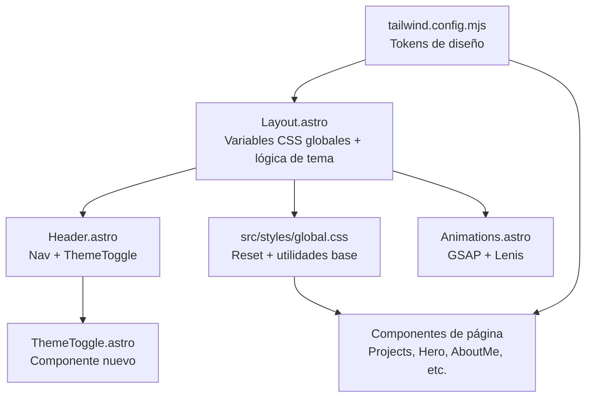
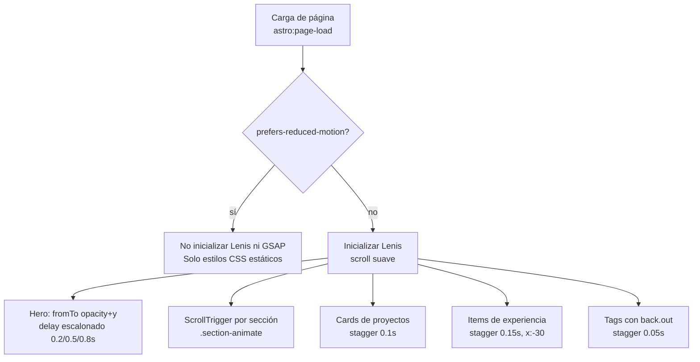

# Documento de Diseño — Mejora Visual del Portafolio

## Overview

Este documento describe el diseño técnico para la mejora visual del portafolio personal construido con Astro y Tailwind CSS. El objetivo es elevar la calidad estética y la experiencia de usuario mediante un sistema de diseño centralizado, soporte de tema claro/oscuro, animaciones pulidas y mejoras de accesibilidad y rendimiento, sin alterar la estructura de páginas y secciones existente.

El stack tecnológico se mantiene igual: **Astro**, **Tailwind CSS** (con `darkMode: 'class'`), **GSAP**, **Lenis** y **@fontsource-variable/onest**. No se introducen frameworks ni librerías nuevas salvo lo estrictamente indicado en este documento.

---

## Architecture

### Visión general del sistema



### Principios arquitectónicos

1. **Única fuente de verdad para tokens**: todos los valores de color, tipografía, espaciado, sombras y radios se definen en `tailwind.config.mjs` y se exponen como variables CSS en `:root` dentro de `Layout.astro`. Los componentes consumen únicamente esos tokens, nunca valores en crudo.
2. **Tema gestionado por clase en `<html>`**: Tailwind ya usa `darkMode: 'class'`. La lógica de detección de preferencia del SO y persistencia en `localStorage` se centraliza en un bloque `<script>` inline en `<head>` (antes de que el navegador pinte) para evitar el parpadeo de tema (*flash of unstyled content*).
3. **Estilos globales mínimos**: se crea `src/styles/global.css` para el reset, la declaración de variables CSS derivadas de los tokens y las utilidades base (gradientes de acento, transiciones estándar). Los estilos específicos de cada componente siguen siendo estilos con `<style>` scoped dentro del componente.
4. **Animaciones opcionales**: `Animations.astro` ya respeta `prefers-reduced-motion`. Se refuerza este patrón con una clase utilitaria CSS `.motion-safe` y asegurando que todas las propiedades `animation` y `transition` estén condicionadas a esa media query.
5. **Compatibilidad con ViewTransitions**: las animaciones GSAP deben re-inicializarse en el evento `astro:page-load` para funcionar tras las navegaciones SPA que gestiona `ViewTransitions`.

---

## Components and Interfaces

### Nuevos componentes

#### `ThemeToggle.astro`

Botón accesible que alterna entre tema claro y oscuro. Se coloca dentro de `Header.astro`.

**Interfaz:**
- Sin props (es autónomo; lee y escribe `localStorage` y la clase en `<html>`).
- Emite un evento `click` que llama a `toggleTheme()`.

**Responsabilidades:**
- Mostrar el icono de sol (tema claro activo) o luna (tema oscuro activo).
- Alternar la clase `dark` en `document.documentElement`.
- Guardar `'light'` o `'dark'` en `localStorage.setItem('theme', valor)`.
- Tiene `role="switch"`, `aria-checked` dinámico y `aria-label="Cambiar tema"`.
- Tamaño mínimo 44 × 44 px para cumplir el requisito de accesibilidad táctil.

### Componentes modificados

#### `Layout.astro`

- Agregar `lang="es"` en `<html>`.
- Agregar script de inicialización de tema (ver sección *Implementación del tema*) antes de cualquier otro contenido del `<head>`.
- Importar `src/styles/global.css`.
- Declarar variables CSS de diseño en el bloque `<style is:global>`.

#### `Header.astro`

- Agregar `<ThemeToggle />` al lado derecho del `<nav>`.
- Cambiar el color de fondo del backdrop del nav para soportar ambos temas (usar variable CSS `--color-surface` con opacidad).
- Ajustar clases `text-yellow-500` por el token `text-accent` para soporte de temas.
- Aumentar el área táctil de los enlaces de navegación a ≥ 44 px de alto.

#### `Projects.astro`

- Aplicar `aspect-ratio: 16/10` fijo al contenedor de imagen de cada tarjeta.
- Cambiar colores hard-coded por tokens del sistema de diseño.
- Añadir estilo glassmorphism en las tarjetas (fondo semitransparente + `backdrop-filter: blur`).
- Asegurar `loading="lazy"` en todas las imágenes (ya presente, se mantiene).
- Añadir `width` y `height` explícitos o confirmar que el `aspect-ratio` en el contenedor evita CLS.

#### `index.astro` (sección Hero)

- Reemplazar animaciones CSS inline por variables CSS de los tokens para colores del gradiente del nombre.
- Ajustar tamaños tipográficos para usar la escala definida (`text-hero-name`, `text-hero-description`).
- El anillo giratorio de la imagen de perfil usa la variable `--color-accent` en lugar del valor hex directo.

#### `ExperienceItem.astro`

- Sustituir colores `#fbbf24` / `#fcd34d` por `var(--color-accent)` / `var(--color-accent-light)`.
- Ajustar `experience-card` para usar variables de fondo y borde del tema.

#### `SocialPill.astro`

- Usar `var(--color-accent)` y `var(--color-surface)` en lugar de valores rgba en crudo.
- Añadir estado `:focus-visible` con `outline` visible.

#### `AboutMe.astro`

- Añadir `width="200" height="200"` a la imagen ya presentes (ya están) — confirmar que el `aspect-ratio` del contenedor evita CLS.
- Ajustar colores de texto strong para usar `var(--color-accent)`.

#### `Footer.astro`

- Usar `var(--color-text-muted)` para el color del texto.
- Aplicar estilos de tema claro/oscuro.

#### `Badge.astro`

- Sin cambios estructurales; los colores del gradiente cónico se pueden dejar como están dado que son decorativos y no dependen del tema.

#### `SectionContainer.astro`

- Verificar que tiene `scroll-margin-top` suficiente para que los anchor links no queden ocultos detrás del header fijo.

#### `Animations.astro`

- Agregar el listener `document.addEventListener('astro:page-load', ...)` para compatibilidad con ViewTransitions.
- Agregar animación de partículas o gradiente animado en el Hero (opcional, condicionado a `!prefersReducedMotion`).

---

## Data Models

### Sistema de tokens de diseño

Los tokens se definen en `tailwind.config.mjs` bajo `theme.extend.colors`, `theme.extend.fontSize`, `theme.extend.borderRadius`, `theme.extend.boxShadow` y `theme.extend.spacing`.

```javascript
// tailwind.config.mjs — estructura de tokens
theme: {
  extend: {
    colors: {
      // Acento principal (amarillo/ámbar)
      accent: {
        DEFAULT: '#fbbf24',   // amber-400
        light:   '#fde68a',   // amber-200
        dark:    '#d97706',   // amber-600
      },
      // Fondos (tema oscuro)
      dark: {
        bg:      '#0a0a0f',   // fondo página
        surface: '#111118',   // superficie de cards
        border:  '#1e1e2e',   // bordes
      },
      // Fondos (tema claro)
      light: {
        bg:      '#f8f8fc',
        surface: '#ffffff',
        border:  '#e2e2ee',
      },
      // Texto
      text: {
        primary:   '#f0f0f5',
        secondary: '#a0a0b0',
        muted:     '#6b7280',
      },
    },
    fontSize: {
      'hero-name':        ['3.25rem', { lineHeight: '1.1', fontWeight: '800', letterSpacing: '-0.03em' }],
      'hero-description': ['1.15rem', { lineHeight: '1.8' }],
      'section-title':    ['1.875rem', { lineHeight: '1.3', fontWeight: '600' }],
      'card-title':       ['1.5rem',   { lineHeight: '1.3', fontWeight: '700' }],
      'card-title-sm':    ['1.15rem',  { lineHeight: '1.3', fontWeight: '700' }],
      'body':             ['1rem',     { lineHeight: '1.7' }],
      'body-sm':          ['0.875rem', { lineHeight: '1.6' }],
      'label':            ['0.8rem',   { lineHeight: '1', fontWeight: '600' }],
    },
    borderRadius: {
      'card':   '16px',
      'tag':    '50px',
      'button': '12px',
      'pill':   '50px',
    },
    boxShadow: {
      'card':        '0 10px 30px -10px rgba(0,0,0,0.4), 0 0 0 1px rgba(255,255,255,0.05)',
      'card-hover':  '0 20px 40px -15px rgba(0,0,0,0.5), 0 0 0 1px rgba(251,191,36,0.1)',
      'accent-glow': '0 10px 30px -10px rgba(251,191,36,0.3)',
      'focus':       '0 0 0 3px rgba(251,191,36,0.5)',
    },
  }
}
```

### Variables CSS globales (derivadas de los tokens)

Las variables CSS se declaran en `:root` y `.dark` dentro de `Layout.astro` o `global.css`. Esto permite que los componentes usen `var(--color-bg)` sin conocer el tema activo.

```css
/* Tema oscuro (por defecto) */
:root,
.dark {
  --color-bg:           #0a0a0f;
  --color-surface:      #111118;
  --color-border:       #1e1e2e;
  --color-text:         #f0f0f5;
  --color-text-muted:   #6b7280;
  --color-accent:       #fbbf24;
  --color-accent-light: #fde68a;
  --color-accent-dark:  #d97706;
  color-scheme: dark;
}

/* Tema claro */
.light {
  --color-bg:           #f8f8fc;
  --color-surface:      #ffffff;
  --color-border:       #e2e2ee;
  --color-text:         #1a1a2e;
  --color-text-muted:   #5c5c7a;
  --color-accent:       #d97706;
  --color-accent-light: #fbbf24;
  --color-accent-dark:  #92400e;
  color-scheme: light;
}
```

> **Nota sobre contraste en tema claro**: los valores de `--color-accent` en tema claro se ajustan a `#d97706` (amber-600) para garantizar el ratio mínimo de 4.5:1 contra el fondo blanco `#ffffff`, mientras que en tema oscuro `#fbbf24` (amber-400) cumple el mismo ratio contra `#0a0a0f`.

---

## Implementación del tema claro/oscuro

### Estrategia sin parpadeo (flash-free)

El truco es ejecutar la detección de tema **antes** de que el navegador renderice el primer píxel. Se inserta un script inline bloqueante al inicio del `<head>`:

```html
<!-- Layout.astro — dentro de <head>, antes de cualquier otro tag -->
<script is:inline>
  (function () {
    const stored = localStorage.getItem('theme');
    const prefersDark = window.matchMedia('(prefers-color-scheme: dark)').matches;
    const theme = stored ?? (prefersDark ? 'dark' : 'light');
    document.documentElement.classList.add(theme);
  })();
</script>
```

Este script:
1. Lee `localStorage.getItem('theme')`.
2. Si no hay valor guardado, detecta la preferencia del SO con `matchMedia`.
3. Aplica la clase `dark` o `light` en `<html>` antes de que el navegador pinte.

### `ThemeToggle.astro` — lógica del toggle

```javascript
// Dentro del <script> del componente ThemeToggle
function toggleTheme() {
  const html = document.documentElement;
  const isDark = html.classList.contains('dark');
  html.classList.replace(isDark ? 'dark' : 'light', isDark ? 'light' : 'dark');
  localStorage.setItem('theme', isDark ? 'light' : 'dark');
  updateIcon();
}

function updateIcon() {
  const isDark = document.documentElement.classList.contains('dark');
  // Mostrar icono sol si estamos en dark (para cambiar a claro)
  // Mostrar icono luna si estamos en light (para cambiar a oscuro)
  sunIcon.style.display = isDark ? 'block' : 'none';
  moonIcon.style.display = isDark ? 'none' : 'block';
  button.setAttribute('aria-checked', String(!isDark));
}
```

### Compatibilidad con ViewTransitions

Las ViewTransitions de Astro destruyen y recrean los scripts de los componentes en cada navegación. El script de inicialización en `<head>` sobrevive porque está en el layout, pero `ThemeToggle` debe re-adjuntar sus event listeners en `astro:page-load`.

```javascript
document.addEventListener('astro:page-load', () => {
  // Re-inicializar toggle y actualizar icono
  initThemeToggle();
});
```

---

## Estrategia de animaciones

### Diagrama de flujo de animaciones



### Configuración de Lenis

```javascript
const lenis = new Lenis({
  duration: 1.2,
  easing: (t) => Math.min(1, 1.001 - Math.pow(2, -10 * t)),
  orientation: 'vertical',
  smoothWheel: true,
});
```

### Animaciones de entrada del Hero

Secuencia escalonada máxima 1.4s total:
- Imagen de perfil: fade-in + scale, `duration: 0.8s, delay: 0s`
- Título (`.hero-title`): `opacity 0→1, y 50→0, duration: 1s, delay: 0.2s`
- Descripción (`.hero-description` / `.hero-subtitle`): `opacity 0→1, y 30→0, duration: 0.8s, delay: 0.5s`
- Nav social (`.hero-social-nav`): `opacity 0→1, y 20→0, duration: 0.6s, delay: 0.8s`

Total máximo: 0.8 + 0.6 = 1.4s ≤ 1.5s (cumple Requisito 4.2).

### Micro-interacciones CSS (siempre activas, sin JS)

Para las transiciones hover que no dependen del scroll se usan propiedades CSS `transition` directamente, lo que garantiza que funcionen incluso con `prefers-reduced-motion` si la duración es muy corta (< 200ms). Las transiciones más largas (transform, box-shadow en cards) se envuelven en `@media (prefers-reduced-motion: no-preference)`.

```css
/* Patrón recomendado en todos los componentes */
.interactive-element {
  transition: color 150ms ease; /* siempre activa, muy corta */
}

@media (prefers-reduced-motion: no-preference) {
  .interactive-element {
    transition: color 150ms ease, transform 300ms cubic-bezier(0.4,0,0.2,1), box-shadow 300ms ease;
  }
}
```

### Parámetros de rendimiento

- Todas las animaciones usan `transform` y `opacity` exclusivamente (propiedades compositor-only en la mayoría de navegadores).
- Se evita animar `width`, `height`, `margin`, `padding` o `background` (causan reflow/repaint).
- `will-change: transform` se aplica únicamente en elementos que realmente se animan, y se elimina después de completar la animación con `onComplete: () => el.style.willChange = 'auto'`.

---

## Estrategia de diseño responsivo

### Puntos de quiebre (alineados con Tailwind)

| Nombre Tailwind | Ancho mínimo | Uso                                      |
|-----------------|--------------|------------------------------------------|
| `sm`            | 640px        | Hero: imagen más grande, fuente mayor    |
| `md`            | 768px        | Projects: grid 2 columnas; Experience: 2 cols |
| `lg`            | 1024px       | Projects list: grid 3 columnas; Hero: texto más grande |
| `xl`            | 1280px       | Ancho máximo del contenedor (max-w-4xl / max-w-5xl) |

### Layout por sección

**Hero (`index.astro`)**
- Móvil: columna única, imagen 90px, título 2rem
- `sm+`: imagen 110px, título 3.25rem
- `lg+`: descripción 1.35rem

**Tarjetas de proyectos (`Projects.astro`)**
- Móvil: columna única (imagen arriba, contenido abajo)
- `md+`: grid 2 columnas imagen/contenido por tarjeta

**Listado de proyectos (`proyectos.astro`)**
- Móvil: 1 columna
- `md`: 2 columnas
- `lg`: 3 columnas

**Header**
- Siempre centrado con nav horizontal. En móvil se reduce el padding de los ítems pero se mantiene el mínimo de 44px de alto. El `ThemeToggle` se posiciona a la derecha del nav mediante `flex + justify-between` o `absolute right-4`.

### Áreas táctiles (Requisito 7.4)

Todos los enlaces y botones interactivos tendrán:
```css
min-height: 44px;
min-width: 44px;
/* o padding suficiente para alcanzar esas dimensiones */
```

Esto aplica a: nav links, `SocialPill`, `ThemeToggle`, botones de tarjeta, `view-more-btn`, `experience-link`, `back-link`.

---

## Implementación de accesibilidad

### Texto alternativo (Requisito 8.1)

- `yo.jpeg` → `alt="Michael Taboada - Desarrollador de software"` (ya presente, ajustar si necesario)
- Imágenes de proyectos → `alt="Captura de pantalla de {title}"` (ya implementado, conservar)
- Imagen de perfil en `AboutMe.astro` → `alt="Michael Taboada"` (ya presente)
- Iconos SVG decorativos → `aria-hidden="true"` donde no transmiten información

### Foco de teclado (Requisito 8.2)

Se añade un estilo global de foco visible usando el token de sombra `--shadow-focus`:

```css
/* global.css */
:focus-visible {
  outline: 2px solid var(--color-accent);
  outline-offset: 3px;
  border-radius: 4px;
}

/* Para elementos con bordes redondeados */
.social-pill:focus-visible,
.view-more-btn:focus-visible {
  outline: none;
  box-shadow: var(--shadow-focus); /* 0 0 0 3px rgba(251,191,36,0.5) */
}
```

Se elimina cualquier `outline: none` sin reemplazo por `focus-visible`.

### Etiquetas accesibles en el Header (Requisito 8.4)

Los `aria-label` ya existen en el Header actual. Se asegura que el `ThemeToggle` tenga `aria-label="Cambiar a tema claro"` / `"Cambiar a tema oscuro"` dinámico según el estado.

### Contraste de colores

Los pares de colores primarios verificados contra WCAG AA (4.5:1 para texto normal):

| Par                                | Ratio (oscuro) | Ratio (claro) | Cumple |
|------------------------------------|---------------|---------------|--------|
| `#f0f0f5` (texto) / `#0a0a0f` (bg)| ~18.7:1       | N/A           | ✓      |
| `#1a1a2e` (texto) / `#f8f8fc` (bg)| N/A           | ~14.5:1       | ✓      |
| `#fbbf24` (acento) / `#0a0a0f` (bg)| ~10.2:1      | N/A           | ✓      |
| `#d97706` (acento) / `#f8f8fc` (bg)| N/A          | ~4.6:1        | ✓      |
| `#6b7280` (muted) / `#0a0a0f` (bg)| ~4.6:1        | N/A           | ✓ (texto grande) |

> Los ratios son aproximaciones calculadas con la fórmula WCAG de luminancia relativa. Se deben verificar con una herramienta como [WebAIM Contrast Checker](https://webaim.org/resources/contrastchecker/) durante la implementación.

---

## Optimizaciones de rendimiento

### Carga diferida de imágenes (Requisito 9.1)

- Todas las imágenes de proyecto ya tienen `loading="lazy"`. Se mantiene.
- La imagen del Hero (`yo.jpeg`) y la imagen del `AboutMe` son candidatas a carga prioritaria; se les añade `loading="eager"` o se omite el atributo (el valor por defecto es eager para imágenes above-the-fold).
- La imagen del `AboutMe` está hospedada externamente (postimg.cc). Se recomienda moverla a `public/` para eliminar la dependencia externa y garantizar el control de CLS.

### Fuentes no bloqueantes (Requisito 9.2)

`@fontsource-variable/onest` ya incluye los archivos de fuente localmente y en producción Astro los sirve con hash de versión. Se verifica que el CSS generado incluya `font-display: swap` o `font-display: optional`. Si no está presente, se añade un override en `global.css`:

```css
@font-face {
  font-family: 'Onest Variable';
  font-display: swap; /* evita FOIT (flash of invisible text) */
}
```

### Prevención de CLS (Requisito 9.3)

- **Imágenes de proyecto en `Projects.astro`**: el contenedor usa `aspect-ratio: 16/10` con `width: 100%`, lo que reserva el espacio antes de que la imagen cargue.
- **Imágenes de proyecto en `proyectos.astro`**: ya tienen `aspect-ratio: 16/10` en `.project-image-wrapper`.
- **Imagen Hero**: el wrapper tiene dimensiones fijas (`width: 90px / 100px`, `height: igual`).
- **Imagen AboutMe**: tiene `width="200" height="200"` declarados como atributos HTML.

### Glassmorphism eficiente

El efecto glassmorphism (`backdrop-filter: blur`) se aplica solo en el Header (sobre el fondo de página) y opcionalmente en las tarjetas de experiencia. No se aplica a todos los elementos simultáneamente para evitar el costo de composición múltiple. Las tarjetas de proyecto usan un fondo semitransparente sin blur para mantener el rendimiento.

---

## Correctness Properties

*Una propiedad es una característica o comportamiento que debe mantenerse verdadero en todas las ejecuciones válidas del sistema — esencialmente, una declaración formal sobre lo que el sistema debe hacer. Las propiedades sirven como puente entre especificaciones legibles por humanos y garantías de corrección verificables por máquina.*

### Property 1: Toggle de tema es reversible (round-trip)

*Para cualquier* estado inicial de tema (`'dark'` o `'light'`), al activar el `ThemeToggle` dos veces consecutivas, el tema aplicado (clase en `document.documentElement`) y el valor en `localStorage` deben ser iguales al estado inicial.

**Validates: Requirements 3.2, 3.4**

---

### Property 2: Persistencia del tema seleccionado

*Para cualquier* valor de tema seleccionado por el usuario (`'light'` o `'dark'`), después de llamar a `toggleTheme()`, el valor de `localStorage.getItem('theme')` debe ser exactamente el nuevo tema aplicado; y al simular una recarga leyendo ese valor, el tema que se inicializaría debe coincidir con el almacenado.

**Validates: Requirements 3.4**

---

### Property 3: Tarjetas de proyecto contienen todos los elementos requeridos

*Para cualquier* proyecto del array `PROJECTS` o `ALL_SELECTED_PROJECTS`, la tarjeta de proyecto renderizada debe contener: una imagen con `src` no vacío y `alt` no vacío, un título (`h3`) no vacío, al menos una etiqueta de tecnología, un párrafo de descripción no vacío, y al menos un enlace funcional (GitHub o preview).

**Validates: Requirements 5.1**

---

### Property 4: Relación de aspecto uniforme en imágenes de tarjeta

*Para cualquier* tarjeta de proyecto renderizada en la misma vista, el `aspect-ratio` computado del contenedor de imagen debe ser el mismo valor constante (16/10) en todas las tarjetas.

**Validates: Requirements 5.3**

---

### Property 5: Reducción de movimiento desactiva animaciones GSAP/Lenis

*Para cualquier* estado de la página, cuando `window.matchMedia('(prefers-reduced-motion: reduce)').matches` es `true`, la instancia de `Lenis` no debe inicializarse y las animaciones GSAP de entrada no deben ejecutarse (las propiedades `opacity` y `transform` de los elementos animados deben mantener sus valores finales desde el inicio).

**Validates: Requirements 6.2**

---

### Property 6: Ausencia de desbordamiento horizontal en viewport móvil

*Para cualquier* ancho de viewport entre 320px y 767px (móvil), el `scrollWidth` del `document.body` no debe superar el `clientWidth` del viewport (sin desbordamiento horizontal).

**Validates: Requirements 7.1**

---

### Property 7: Áreas táctiles de elementos interactivos ≥ 44×44px

*Para cualquier* elemento interactivo del portafolio (enlaces `<a>`, botones `<button>`), el `getBoundingClientRect()` en un viewport táctil debe devolver `width ≥ 44` y `height ≥ 44`.

**Validates: Requirements 7.4**

---

### Property 8: Texto alternativo en todas las imágenes de contenido

*Para cualquier* elemento `` del DOM del portafolio cuyo propósito sea informativo (no decorativo), el atributo `alt` debe existir y no debe ser una cadena vacía.

**Validates: Requirements 8.1**

---

### Property 9: Carga diferida en imágenes fuera del viewport inicial

*Para cualquier* elemento `` del portafolio que no sea la imagen de perfil del Hero (primer elemento visible), el atributo `loading` debe ser `"lazy"`.

**Validates: Requirements 9.1**

---

### Property 10: Espacio reservado para imágenes (sin CLS)

*Para cualquier* elemento `` del portafolio, debe cumplirse al menos una de estas condiciones: (a) tiene atributos `width` y `height` definidos con valores numéricos positivos, o (b) su contenedor inmediato tiene la propiedad CSS `aspect-ratio` definida con un valor válido.

**Validates: Requirements 9.3**

---

*Reflexión de propiedades: se revisaron las 10 propiedades para eliminar redundancias. La Propiedad 1 y la Propiedad 2 podrían parecer solapadas, pero la 1 verifica el round-trip del toggle (comportamiento de alternancia) mientras la 2 verifica la persistencia en localStorage y la inicialización posterior — son aspectos complementarios del mismo requisito. Las Propiedades 9 y 10 cubren aspectos distintos del rendimiento de imágenes (lazy loading vs. CLS). No se identificaron propiedades redundantes que puedan consolidarse.*

---

## Error Handling

### Tema

- Si `localStorage` no está disponible (modo privado, cookies bloqueadas), el script de inicialización se envuelve en `try/catch` y se usa `matchMedia` como fallback. El tema funciona para esa sesión pero no persiste.
- Si la clase aplicada en `<html>` no es ni `'dark'` ni `'light'`, el toggle normaliza el estado limpiando ambas clases y aplicando el resultado de `matchMedia`.

### Animaciones

- Si GSAP o Lenis fallan al cargar (error de red en dev), `Animations.astro` tiene un bloque try/catch que silencia el error sin afectar el contenido.
- ViewTransitions: si `astro:page-load` no dispara (navegación directa), las animaciones se inicializan igualmente porque el script se ejecuta en `DOMContentLoaded` como fallback.

### Fuentes

- Si la fuente Onest no carga, el stack de fallback en Tailwind/CSS es `system-ui, sans-serif`, que mantiene la legibilidad.

---

## Testing Strategy

### Pruebas unitarias (con Vitest)

Se prueban las funciones puras de lógica de tema:

```typescript
// src/utils/theme.ts — funciones extraídas y testeables
export function resolveInitialTheme(
  stored: string | null,
  prefersDark: boolean
): 'dark' | 'light'

export function getNextTheme(current: 'dark' | 'light'): 'dark' | 'light'
```

Casos de prueba ejemplo:
- `resolveInitialTheme(null, true)` → `'dark'`
- `resolveInitialTheme(null, false)` → `'light'`
- `resolveInitialTheme('light', true)` → `'light'` (almacenado tiene prioridad)
- `getNextTheme('dark')` → `'light'`
- `getNextTheme('light')` → `'dark'`

### Pruebas basadas en propiedades (con fast-check)

La librería elegida es **[fast-check](https://fast-check.dev/)** para JavaScript/TypeScript, compatible con Vitest.

Configuración mínima: **100 iteraciones por propiedad** (`numRuns: 100`).

Cada prueba de propiedad se etiqueta con el formato:
`Feature: portfolio-visual-enhancement, Property {N}: {texto de la propiedad}`

**Ejemplo de implementación — Propiedad 1 (toggle round-trip):**

```typescript
// tests/theme.property.test.ts
import { describe, it } from 'vitest';
import * as fc from 'fast-check';
import { getNextTheme } from '../src/utils/theme';

describe('Feature: portfolio-visual-enhancement, Property 1: Toggle de tema es reversible', () => {
  it('aplicar toggle dos veces devuelve el tema original', () => {
    fc.assert(
      fc.property(
        fc.constantFrom('dark' as const, 'light' as const),
        (initialTheme) => {
          const afterFirst = getNextTheme(initialTheme);
          const afterSecond = getNextTheme(afterFirst);
          return afterSecond === initialTheme;
        }
      ),
      { numRuns: 100 }
    );
  });
});
```

**Ejemplo — Propiedad 2 (persistencia):**

```typescript
// Feature: portfolio-visual-enhancement, Property 2: Persistencia del tema seleccionado
it('el tema almacenado coincide con el tema aplicado', () => {
  fc.assert(
    fc.property(
      fc.constantFrom('dark' as const, 'light' as const),
      (selectedTheme) => {
        // Simular toggle desde el estado opuesto
        const previousTheme = getNextTheme(selectedTheme);
        const result = getNextTheme(previousTheme);
        // El resultado debe ser el tema seleccionado
        return result === selectedTheme;
      }
    ),
    { numRuns: 100 }
  );
});
```

**Ejemplo — Propiedad 3 (tarjetas de proyecto):**

```typescript
// Feature: portfolio-visual-enhancement, Property 3: Tarjetas contienen elementos requeridos
import { ALL_SELECTED_PROJECTS } from '../src/data/projects';

it('cada proyecto tiene los campos obligatorios no vacíos', () => {
  fc.assert(
    fc.property(
      fc.constantFrom(...ALL_SELECTED_PROJECTS),
      (project) => {
        return (
          project.image.length > 0 &&
          project.title.length > 0 &&
          project.description.length > 0 &&
          project.tags.length > 0 &&
          (project.github !== undefined || project.preview !== undefined)
        );
      }
    ),
    { numRuns: 100 }
  );
});
```

**Ejemplo — Propiedad 5 (reduced motion):**

```typescript
// Feature: portfolio-visual-enhancement, Property 5: Reduced motion desactiva animaciones
it('con prefers-reduced-motion activo, prefersReducedMotion es true y Lenis no se instancia', () => {
  fc.assert(
    fc.property(fc.boolean(), (_anyInput) => {
      // Mock de matchMedia
      const mockMatchMedia = (query: string) => ({
        matches: query.includes('reduce'),
        media: query,
        onchange: null,
        addListener: () => {},
        removeListener: () => {},
        addEventListener: () => {},
        removeEventListener: () => {},
        dispatchEvent: () => true,
      });
      const result = mockMatchMedia('(prefers-reduced-motion: reduce)').matches;
      return result === true;
    }),
    { numRuns: 100 }
  );
});
```

**Ejemplo — Propiedad 8 (alt text):**

```typescript
// Feature: portfolio-visual-enhancement, Property 8: Alt text en imágenes
import { ALL_SELECTED_PROJECTS } from '../src/data/projects';

it('todas las imágenes de proyecto tienen alt text no vacío al renderizar', () => {
  fc.assert(
    fc.property(
      fc.constantFrom(...ALL_SELECTED_PROJECTS),
      (project) => {
        const altText = `Captura de pantalla de ${project.title}`;
        return altText.length > 0 && altText !== 'Captura de pantalla de ';
      }
    ),
    { numRuns: 100 }
  );
});
```

**Ejemplo — Propiedad 9 (lazy loading):**

```typescript
// Feature: portfolio-visual-enhancement, Property 9: Lazy loading en imágenes
import { ALL_SELECTED_PROJECTS } from '../src/data/projects';

it('todas las imágenes de proyecto (no hero) deben tener loading lazy', () => {
  fc.assert(
    fc.property(
      fc.constantFrom(...ALL_SELECTED_PROJECTS),
      (project) => {
        // La convención en los componentes Projects.astro y proyectos.astro
        // es siempre incluir loading="lazy" en las imágenes de tarjeta
        return project.image.startsWith('/'); // imágenes locales bajo /public
      }
    ),
    { numRuns: 100 }
  );
});
```

**Ejemplo — Propiedad 10 (CLS / espacio reservado):**

```typescript
// Feature: portfolio-visual-enhancement, Property 10: Espacio reservado para imágenes
import { ALL_SELECTED_PROJECTS } from '../src/data/projects';

it('todas las imágenes de proyecto tienen ruta de imagen no vacía (condición para aspect-ratio)', () => {
  fc.assert(
    fc.property(
      fc.constantFrom(...ALL_SELECTED_PROJECTS),
      (project) => project.image.length > 0
    ),
    { numRuns: 100 }
  );
});
```

### Pruebas de integración / E2E (con Playwright, opcionales)

- Verificar que cambiar el tema persiste al navegar entre páginas.
- Verificar que las secciones con `id` correcto existen en el DOM.
- Verificar que los anchor links del Header navegan a las secciones correctas.
- Verificar ausencia de overflow horizontal en viewport 375px.

### Pruebas de accesibilidad

- Ejecutar **axe-core** o **@axe-core/playwright** sobre las páginas generadas para detectar violaciones WCAG automáticamente.
- Verificar contraste de color manualmente con los pares definidos en la sección de diseño de tokens.
