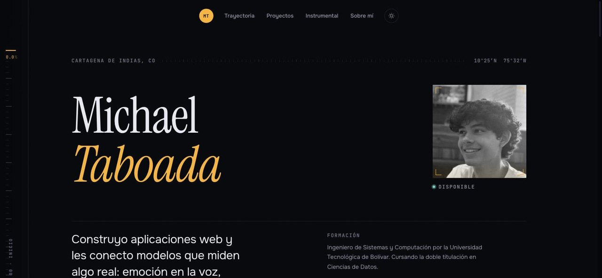

# Portafolio — Michael Taboada

Portafolio personal construido con [Astro](https://astro.build). Ingeniero de
Sistemas y Computación, cursando la doble titulación en Ciencias de Datos en la
Universidad Tecnológica de Bolívar (Cartagena, Colombia).

**[Ver el sitio →](https://portafolio-astro-michael.netlify.app/)**



---

## Dirección de diseño: «Instrumento»

El sitio no usa una plantilla. Su lenguaje visual sale del propio trabajo que
muestra: estimación de gravedad por visión computacional, FFT de un péndulo,
coeficiente de restitución, clasificación de cobertura terrestre con Sentinel-2,
embeddings de emoción en voz, simulaciones Monte Carlo. Todo ese corpus consiste
en **sensar y cuantificar**, así que los recursos estructurales de la página son
recursos de medición: marcas de escala, corchetes de encuadre y telemetría en
monoespaciada.

El elemento que lo sostiene es el **riel de instrumento**: una regla fija en el
borde izquierdo, con marcas y un cursor que sigue la posición de scroll e imprime
la lectura y la sección actual. Es orientación funcional, no adorno.

### Color

Dos acentos con reglas estrictas, sobre un campo profundo con sesgo azul-violeta
(nunca negro neutro):

| Rol | Oscuro | Claro | Uso |
| --- | --- | --- | --- |
| `--ink` | `#06070c` | `#eceef3` | Fondo |
| `--paper` | `#e9eaf2` | `#0d1017` | Texto |
| `--signal` | `#ffb020` | `#5b2ee0` | Identidad: enlaces, estado activo, acentos |
| `--reading` | `#54d6c4` | `#0e9384` | **Solo** valores medidos. Nunca decorativo |

### Tipografía

Tres roles, tres voces:

- **Instrument Serif** — display, usado con moderación: el nombre, los títulos de
  sección, la cita destacada.
- **Onest Variable** — prosa.
- **JetBrains Mono Variable** — toda la telemetría: etiquetas, fechas, unidades,
  índices, coordenadas.

La escala es fluida (`--step--2` a `--step-7` con `clamp()`), así que no hay
saltos bruscos entre breakpoints.

---

## Estructura

```
src/
├─ components/
│  ├─ InstrumentRail.astro   Riel de medición (elemento firma)
│  ├─ Header.astro           Dock flotante + índice móvil
│  ├─ Hero.astro             Portada
│  ├─ Readout.astro          Tira de cuatro cifras verificables
│  ├─ Section.astro          Encabezado de sección reutilizable
│  ├─ Experience.astro       Trayectoria (registro tabulado)
│  ├─ Projects.astro         Casos destacados
│  ├─ Stack.astro            Instrumental, agrupado por capa
│  ├─ AboutMe.astro          Biografía
│  ├─ Contact.astro          Cierre y contacto
│  └─ TagChip.astro          Etiqueta de tecnología
├─ data/projects.ts          Fuente única de proyectos y etiquetas
├─ layouts/Layout.astro      Head, metadatos, tema, riel
├─ pages/
│  ├─ index.astro            Portada
│  ├─ proyectos.astro        Archivo completo
│  └─ proyecto/[slug].astro  Caso individual
└─ styles/global.css         Sistema de diseño: tokens, escala, base
```

Los proyectos viven en `src/data/projects.ts` como única fuente de verdad. Marca
`featured: true` para que un proyecto aparezca en la portada; el archivo y las
páginas de caso se generan solos.

---

## Desarrollo

```sh
npm install
npm run dev      # servidor local en localhost:4321
npm run build    # astro check + build a dist/
npm run preview  # sirve dist/ localmente
```

---

## Decisiones técnicas

- **El sistema de diseño vive en CSS**, no en la configuración de Tailwind.
  `src/styles/global.css` define todos los tokens como variables CSS; Tailwind se
  conserva únicamente por su preflight. Esto permite que el cambio de tema sea un
  intercambio de variables en `<html>` y que los estilos con ámbito de cada
  componente lean los mismos tokens.
- **Sin librería de animación.** El revelado al hacer scroll es
  `IntersectionObserver` que añade una clase; la transición la hace CSS. Si el JS
  no carga, el contenido queda visible igual. Solo se usa
  [Lenis](https://lenis.darkroom.engineering/) para el scroll suave.
- **El tema se aplica antes del primer pintado** con un script en línea en
  `<head>`, así que no hay parpadeo. El listener del botón está delegado en
  `document` para sobrevivir a las navegaciones de View Transitions.
- **La descripción larga de cada proyecto** se escribe en un Markdown mínimo
  (negritas, viñetas, encabezados de una línea) y se renderiza a HTML real en
  `proyecto/[slug].astro`.

## Accesibilidad

- Contraste AA verificado en ambos temas, incluidos los tonos apagados que
  rotulan fechas y unidades.
- Objetivos táctiles de ~44px bajo `@media (pointer: coarse)`, usando relleno
  compensado con margen negativo para no alterar el diseño en escritorio.
- `prefers-reduced-motion` desactiva el scroll suave, los revelados y los
  contadores.
- Enlace para saltar al contenido, foco visible en todo elemento interactivo y
  navegación por teclado en el índice móvil (`Escape` lo cierra).

---

## Créditos

La primera versión de este portafolio partió del
[porfolio.dev de midudev](https://github.com/midudev/porfolio.dev). El diseño
actual es propio.
